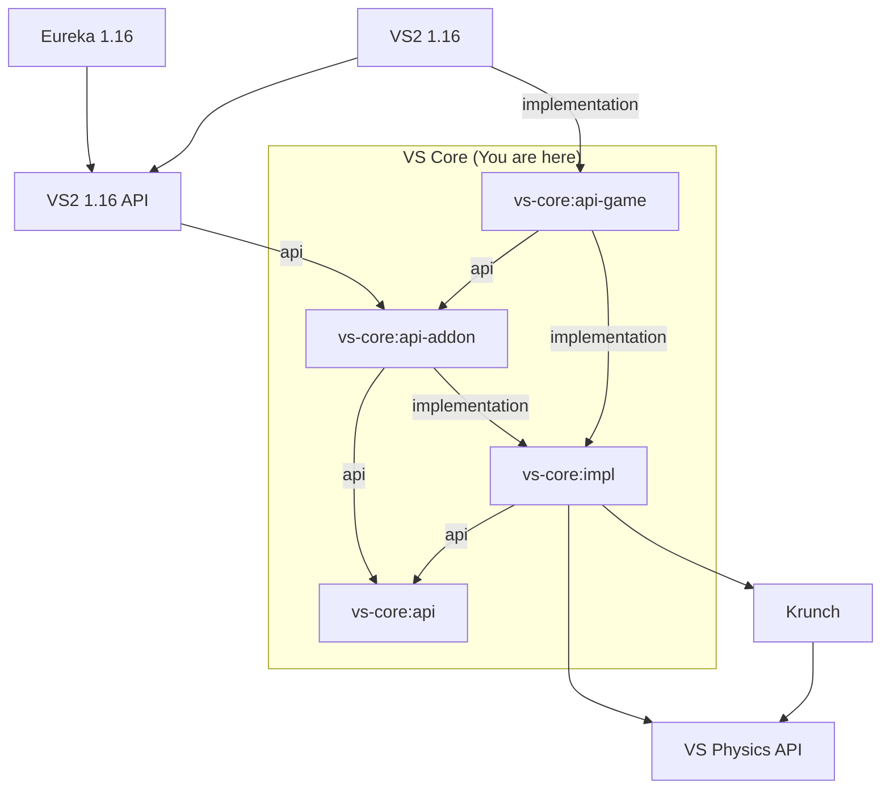

# VS Core Architecture Overview

## Dependency Graph (non-exhaustive)

Note: `implementation` and `api` have the same meaning they do in gradle - `api`
dependencies are as part of the module's public API, `implementation`
dependencies are not

